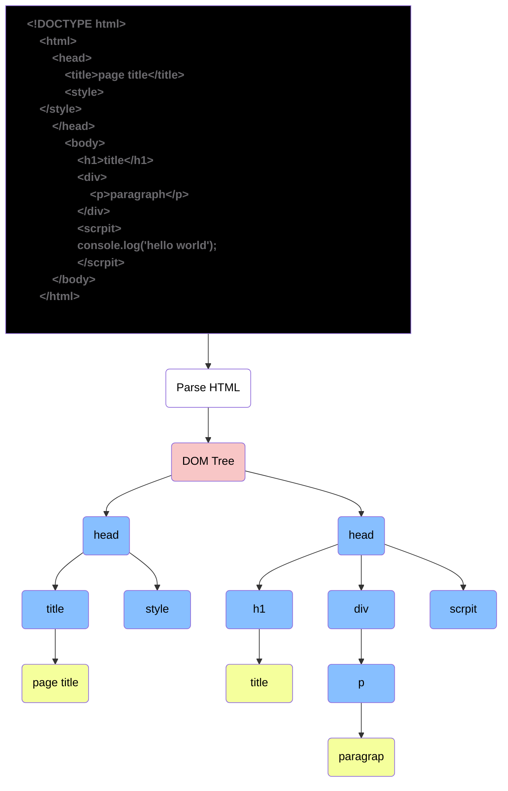
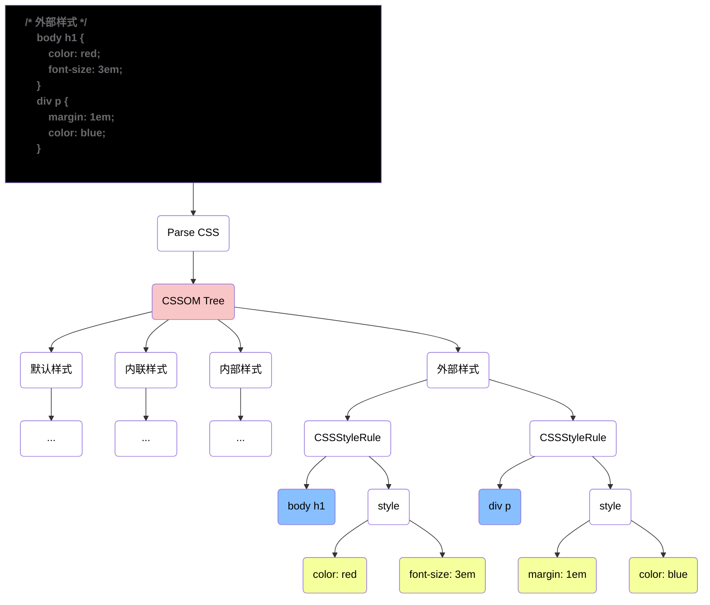
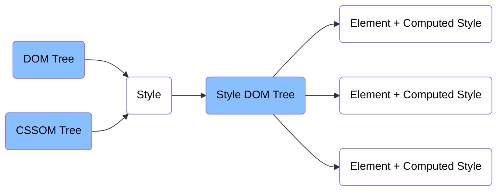
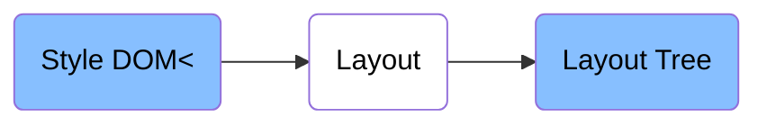

# Browser

## 入门

浏览器是`多进程` `多线程`的`应用程序`

## 进程

### 浏览器进程

软件UI,用户交互,启动其他进程

`浏览器进程`会启动多个`浏览器线程`处理不同任务

### 网络进程

主要用于加载网络资源

`网络进程`内部会启动多个`网络线程`处理不同的`网络任务`

### 插件进程

为`浏览器插件`提供运行环境,如:`Flash插件` `PDF插件`

### GPU进程

### 渲染进程

`渲染进程`放置在`沙盒`中,与电脑硬件操作系统隔离开,这一举措极大地提升了安全性,即使`渲染进程`遭受攻击,影响范围也仅局限于浏览器本身,不会波及电脑硬件 操作系统

由于沙盒机制,渲染进程无法直接操作 GPU。需通过中转至 GPU 进程,进而实现对 GPU 的操作。这种间接交互方式在保障安全的同时,也在一定程度上影响了交互效率

`渲染进程`开启`渲染主线程`,此`主线程`负责执行`HTML` `CSS` `JS`代码,它是网页内容渲染和交互逻辑执行的核心,决定了网页的显示效果和用户交互响应

默认情况下,浏览器会为每个标签页启动一个独立的`渲染进程`,这样做能确保每个标签页之间相互独立,互不影响,即便某个标签页出现崩溃等问题,也不会影响其他标签页的正常运行

目前`谷歌浏览器`试图改变每个标签页对应一个`渲染进程`的模式,因为当标签页数量过多时,会严重影响浏览器性能。其目标方向是针对同一站点(相同网站)使用同一个进程,以此优化资源占用,提升浏览器整体性能

#### 渲染主线程

`渲染主线程`正在执行`任务`时,新增的`任务`,会进入`任务队列`,`渲染主线程`每次执行完当前`任务`会从`任务队列`取出一个新的`任务`执行,如果`任务队列`没有`任务`,则`渲染主线程`进入休眠状态,期间`其他线程`向`任务队列`添加新`任务`时,`渲染主线程`会唤醒

`渲染主线程`是浏览器渲染过程中的核心执行者,负责众多关键任务,`解析HTML` `解析CSS` `计算样式` `规划布局` `处理图层` `渲染画面` `运行全局JS` `事件处理函数` `计时器回调函数`

##### JavaScript异步

`JavaScript`代码在执行过程中,会遇到一些无法立即执行的任务(`setTimeout()` `setInterval`),这些任务在如果运行在`渲染主线程`会阻塞主线程导致浏览器卡死

`单线程`是`异步`产生的原因

`事件循环/消息循环`是`异步`实现的方式

##### JavaScript阻碍渲染

`渲染主线程`在执行`JavaScript`代码时可能会新增`渲染任务`,然而`渲染主线程`处于忙碌状态,无法运行`渲染任务`,只能等当前执行的`JavaScript任务`执行完毕时,才会调度执行`渲染任务`,这就会导致用户看到卡死的现象

##### 任务优先级

`任务`本身无优先级之分,但`任务队列`存在优先级差异

添加`微队列`任务的操作有 `Promise.resolve().then(function(){})` `async/await (本质上是Promise)` `MutationObserver` 等

###### 过去队列

|   队列   |       名称        |                             注释                             |
| :------: | :---------------: | :----------------------------------------------------------: |
| `宏队列` | `macrotask queue` | 普通任务队列,`setTimeout()` `setInterval()`等任务会被添加到`宏队列` |
| `微队列` | `microtask queue` | 优先任务队列,每次主线程执行完一个任务后,会优先处理微队列中的所有任务 |

###### 现在队列

`W3C`规定,每个`任务`都有对应的`任务类型`,相同类型的任务会被放入同一个队列,不同类型任务可处于不同队列,使得任务管理更加精细
	在一次`事件循环/消息循环`中,浏览器会根据实际情况,从不同队列中选取一个任务执行,体现了任务调度的灵活性和智能性
	浏览器必须准备好一个`微队列`,`微队列`的执行优先级高于所有其他队列

###### Chrome浏览器

目前`Chrome浏览器`至少包含以下队列

|    队列    | 优先级 |          注释          |
| :--------: | :----: | :--------------------: |
|  `微队列`  | `最高` |      最先执行任务      |
| `交互队列` |  `高`  | 用户操作产生的事件任务 |
| `延时队列` |  `中`  |     计时器回调任务     |

## 章节

### 浏览器渲染原理

```mermaid
graph TB
	classDef Start fill:#FFFFFF,color:#000000;
	classDef A fill:#00FFFF,color:#000000;
	classDef B fill:#FFFF00,color:#000000;
	classDef C fill:#FF00FF,color:#000000;
	classDef D fill:#00FF00,color:#000000;
    A(<div style="text-align:center;width:128px;">合成线程</div>):::B
    B(<div style="text-align:center;width:128px;">渲染主线程</div>):::A
    Start(<div style="text-align:center;width:128px;">Start</div>):::Start
    C(<div style="text-align:center;width:128px;">GPU进程</div>):::C
    D(<div style="text-align:center;width:128px;">GPU硬件</div>):::D
    Start -.<div style="background:gray;color:white;font-size:12px;transform:translateY(-4px)">HTML文档</div>.-> E(<div style="text-align:center;width:64px;">①解析</div>):::A
    -.<div style="background:gray;color:white;font-size:12px;transform:translateY(-4px)">DOM Tree & CSSOM Tree</div>.-> F(<div style="text-align:center;width:64px;">②样式</div>):::A
    -.<div style="background:gray;color:white;font-size:12px;transform:translateY(-4px)">Computed Style DOM Tree</div>.-> G(<div style="text-align:center;width:64px;">③布局</div>):::A
    -.<div style="background:gray;color:white;font-size:12px;transform:translateY(-4px)">Layout Tree</div>.-> H(<div style="text-align:center;width:64px;">④分层</div>):::A
    -.<div style="background:gray;color:white;font-size:12px;transform:translateY(-4px)">Layer Tree</div>.-> I(<div style="text-align:center;width:64px;">⑤绘制</div>):::A
    
    I -.<div style="background:gray;color:white;font-size:12px;transform:translateY(-4px)">Draw Instruction Set</div>.->  J
    J(<div style="text-align:center;width:64px;">⑥分块</div>):::B
    J --- K(<div style="text-align:center;width:64px;">分块器1</div>):::B
    J --- L(<div style="text-align:center;width:64px;">分块器2</div>):::B
    J --- M(<div style="text-align:center;width:64px;">分块器3</div>):::B
    K --> N
    L -.<div style="background:gray;color:white;font-size:12px;transform:translateY(-4px)">Layer Data</div>.-> N
    M --> N
    N(<div style="text-align:center;width:64px;">⑦光栅</div>):::C
    -.<div style="background:gray;color:white;font-size:12px;transform:translateY(-4px)">Bitmap Data</div>.-> O(<div style="text-align:center;width:auto;">⑧画#40;生成指引&#41;</div>):::B
    --> P(<div style="text-align:center;width:auto;">⑧画#40;调用显卡&#41;</div>):::C
    --> Q(<div style="text-align:center;width:auto;">⑧画#40;屏幕成像&#41;</div>):::D
```



#### 解析

获取`HTML文档(字符串)`并解析,输出`DOM Tree`和`CSSOM Tree`对象

`DOM Tree` `HTML文档各个`标签/元素`的关系组成的树结构对象,底层是`C++`数据,通过`JavaScript`包装,可以使`JavaScript`能够访问`C++`对象数据



`CSSOM Tree`为样式表组,其中包含多个`样式表`类型的二级节点(`内联样式` `内部样式` `外部样式` `默认样式(浏览器)`),并且每通过`<link>`标签引入一次`样式表`则多生成一个`二级节点`,其中每个样式表中都包含一个`CSS Style Rule`规则对象,每个`CSS Style Rule`对象又包含`选择器`和`样式对象`

`JavaScript`可以操作`默认样式`以外的其他样式



#### 样式



#### 布局

布局输出每个元素的尺寸和位置组成的`Layout Tree`

隐藏元素不会出现再`Layout Tree`中,`::beffor`伪元素虽然再`DOM Tree`中不存在,但是在`Layout Tree`中存在

HTML的`文本/内容`必须存放在`行盒`中,所以在`块盒`中的`文本/内容`会使用`匿名行盒`封装,而未被包装的`文本/内容`则会先使用`匿名块盒`包装后再使用`匿名行盒`包装



#### 分层

`渲染主线程`使用一套复杂的策略对整个`Layout Tree`进行`分层`处理

`分层`有利于后续某个`元素`发生改变,则仅对该层操作即可,从而提高效率

`滚动条` `堆叠上下文` `transform` `opacity` 或多或少的会影响分层结果

可以使用`will-change`属性更大程度的影响`分层`结果

`分层`处理无法直接人为影响,只能通过以上方式间接影响`分层`结果

#### 绘制

`渲染主线程`会为每个`分层`单独输出一个`绘制指令集`,用于描述该层的内容如何绘制

#### 分块

`绘制`完成后`渲染主线程`会将每个`绘制指令集`交给`合成线程`处理,`合成线程`会对图层进行分块划分,将其分割成多个小区域,然后会从`线程池`中取出多个线程来完成接下来的工作

#### 光栅化

`合成线程`会将块信息交给`GPU进程`,以极高的速度完成`光栅化`,`GPU进程`会开启多个线程来完成`光栅化`,并且优先处理靠近视窗区域的块,`光栅化`的结果就是一块块的`位图`

#### 画

`合成线程`拿到位图后,生成多个`quad(指引信息)`,`quad(指引信息)`会标识除每个位图该绘制到屏幕的位置,以及`旋转` `变形`等

`合成线程`会把`quad(指引信息)`提交给`GPU进程`,由`GPU进程`产生系统调用`GPU硬件`完成最终的屏幕成像

## 问题

> $Q:$ 如何理解`JavaScript`的异步?
>
> $A:$ `JavaScript`是`单线程语言`,这是因为`JavaScript`运行在浏览器的`渲染主线程`中,而`渲染主线程`只有一个,且承担着诸多任务,`渲染页面` `运行JavaScript`等任务都在其中
> 	如果使用`同步`方式运行就极有可能产生`线程阻塞`,从而导致`渲染主线程`无法及时执行`任务队列`中的其他任务,不仅会白白浪费时间,还会导致页面无法刷新给用户造成卡死的现象
> 	浏览器采用`异步`的方式来避免,具体方法当执行某些任务时(`计时器` `网络相关` `事件监听`),`渲染主线程`会将`任务`交给`其他线程`去处理,自身立即结束对该任务的执行,转而执行`任务队列`后续的任务,`其他线程`完成时会将事先传递的`回调函数`包装成`任务`放入`任务队列`末尾,等待`渲染主线程`调度执行
> 	这种`异步`方式运行,浏览器的`渲染主线程`不会`阻塞`,从而最大限度的保证了单线程的流畅运行

>$Q:$ 阐述以下`事件循环/消息循环`
>
>$A:$ `事件循环`又叫做`消息循环`,因为官方描述`event loop`而`浏览器(Chrome)`内部实现名为`message loop`,是浏览器`渲染主线程`的工作方式,在`Chrome`源码中,开启一个不会结束的`for`循环,每次循环从`任务队列`中取出第一个任务执行,而其他线程只需要在合适的时候将`任务`添加到`任务队列`的末尾即可
>	过去把`任务队列`简单分为`宏队列`和`微队列`,但是已经无法满足目前浏览器的复杂环境,取而代之的是一种更加灵活的方式
>	在`W3C`官方文档中,每个任务都有一个任务类型,且相同类型的任务只能放在同一个队列中,不同类型任务可以放在不同队列中,每次`事件循环/消息循环`都会由浏览器自行决定取出某个`任务队列`中的`任务`,但是浏览器必须有一个`微队列`,且`微队列`的执行优先级高于其他全部队列

>$Q:$ `JavaScript`的计时器能做到精确计时吗?为什么?
>
>$A:$ 不能
>	计算机硬件本身没有原子钟,其计时依赖于`CPU寄存器`,原子钟能提供高精度的时间计量,而`CPU寄存器`的计时方式存在一定局限性,无法达到原子钟那样的精准度,这是导致 `JavaScript`计时器无法精准计时的基础硬件因素
>	操作系统的计时函数本身就存在少量偏差,`JavaScript`计时器在底层最终调用的是操作系统的计时函数,所以这些操作系统计时函数的偏差会被传递给`JavaScript`计时器,从而使得`JavaScript`计时器也不可避免地存在计时误差
>	按照`W3C`的标准,在浏览器环境实现计时器时,如果计时器嵌套层级超过5层,第6层及以后的计时器会带有至少4毫秒的延迟。当需要计时的时间少于4毫秒时,这个标准规定就会给计时带来额外的偏差,影响计时的精准性
>	`JavaScript`是单线程语言,依赖`事件循环/消息循环`机制来处理`异步任务`,计时器的`回调函数`作为`异步任务`,只能在`渲染主线程`空闲时才能被执行。如果`渲染主线程`有大量`同步任务`在执行,计时器的`回调函数`就需要等待,这会导致实际执行时间与设定的计时时间存在偏差,无法做到精准计时
>	这种误差也被称之为`计时误差(Timing Error)` `延迟偏差(Latency Deviation)` `时间漂移(Time Drift)`

> $Q:$ 浏览器是如何渲染页面的?
>
> $A:$ 当浏览器的`网络线程`接收到`HTML文档`后,会产生一个`渲染任务`并传递给`渲染主线程`的`任务队列`,在`事件循环/消息循环`机制作用下,`渲染主线程`取出`渲染任务`,开启渲染流程
> 	`解析`,为提高解析效率,开始解析前会启用`预解析线程`率先下载`外部样式`的`CSS文件`,解析过程中遇到`CSS`则解析,遇到`JS`则执行
> 	遇到`<link>`标签时,若`预解析线程`还未下载好`CSS文件` `渲染主线程`不会等待,而是继续解析后的内容,因为下载和解析`CSS`在`预解析线程`中进行
> 	遇到`<script>`标签时,会暂停解析,等待`JavaScript`文件下载好,且`全局JavaScript`运行完毕后,才会继续解析,这是因为`JavaScript`执行过程中可能会修改当前`DOM Tree`,所以`DOM Tree`的生成必须暂停
> 	`样式`,根据上一步生成的`DOM Tree`和`CSSOM Tree`将`CSSOM Tree`的样式结果结合到`DOM Tree`上,为`DOM Tree`上的每个元素添加样式属性
> 	在计算样式过程中`渲染主线程`会遍历`DOM Tree`,为每个元素的样式计算为`Computrd Style(最终样式)`,在此过程中很多预设值会被替换为绝对值,颜色`red`替换为`RGB(255,0,0)`,长度单位`em`替换为计算后的`px`
> 	`布局`,根据上一步生成含有`Computrd Style(最终样式)`的`DOM Tree`,依次遍历`DOM Tree`的每个节点,计算节点的宽高和相对包含块位置等几何信息
> 	由于`display:none`的元素不会显示,没有几何信息也就不会出现在`Layout Tree`上,而`::before`伪元素虽然在`DOM Tree`中不存在,但是却拥有几何信息,则会出现在`Layout Tree`上,大部分的时候`DOM Tree`和`Layout Tree`并不会逐一对应
> 	`分层`,根据上一步生成的`Layout Tree` `渲染主线程`使用复杂策略对整个`Layout Tree`进行`分层`,`分层`好处是当某一层改变时,仅对该层进行后续处理,从而提高效率
> 	调整`滚动条` `堆叠上下文` `transform` `opacity` 等样式以及 `will-change` 属性会影响分层结果
> 	`绘制`,`渲染主线程`为每个`分层`单独产生`绘制指令集`,用于描述该层内容的绘制方式
> 	`分块`,完成`绘制`后,`渲染主线程`将每个图层的绘制信息提交给`合成线程`,`合成线程`对图层进行分块,将其划分为多个更小区域,并从`线程池`取出多个`线程`完成`分块`工作
> 	`光栅化`,`合成线程`将块信息交给`GPU进程`,`GPU进程`开启多个`线程`以极高速度完成`光栅化`,并且优先处理靠近`视窗`区域的块,光栅化结果是一块块的`位图`
> 	`画`,`合成线程`拿到每个块的`位图`后,生成`quad(指引信息)`标识每个`位图`应画到屏幕的位置,并考虑`旋转` `缩放` `变形`等,`合成线程`把 `quad(指引信息)` 提交给`GPU进程`,由`GPU进程`产生`系统调用`,提交给`GPU硬件`完成最终的屏幕成像
> 	由于`旋转` `缩放` `变形`发生在`合成线程`,与`渲染主线程`无关,所以这就是 `transform` 效率高的本质原因,且当`渲染主线程`忙碌时,这些效果产生的变化不会`阻塞`
> 	`总结`,整个`渲染流程`中,每个阶段都有明确的输入输出,上个阶段的输出会成为下个阶段的输入,形成一套组织严密的生产流水线

>$Q:$ 在`渲染主线程`解析过程中遇到`<link>`标签的`CSS文件`浏览器会如何处理?
>
>$A:$ 为提升解析效率,浏览器会启动`预解析器`,`预解析器`会快速浏览代码,确定`<link>`标签指向的`CSS文件`,借助`网络线程`对相应的`CSS文件`进行下载,下载完成后,`预解析器`会预先解析部分`CSS`,完成一些铺垫工作,`预解析`后的`CSS`信息会被提供给`渲染主线程`,使`渲染主线程`在构建`CSSOM Tree`时效率大幅提高,而`渲染主线程`在解析时遇到`<link>`元素时会进行相关处理,以配合`CSS`的加载和后续`渲染流程`

> $Q:$ 什么是`reflow(回流/重排)`?
>
> $A:$ `reflow(回流/重排)`指的是浏览器重新计算文档中元素的布局信息,也就是重新构建`Layout Tree`的过程,`Layout Tree`包含了元素的`大小` `位置` `边距` `填充`等几何信息,这些信息决定了元素在页面上的呈现位置和外观
> 	当对文档进行某些操作影响到元素的`布局`信息时,就会触发`reflow`,修改元素的`宽度` `高度` `边距` `填充` `position`等`CSS属性`,添加或删除`Element`,改变字体大小,浏览器窗口大小等
> 	为了提高性能,避免因连续的多次布局操作导致`Layout Tree`反复计算,浏览器会对这些操作进行合并,当`JavaScript`执行过程中进行了一系列会影响布局的操作时,浏览器不会立即进行重新计算,而是等待`JavaScript`代码全部执行完成后,再进行统一的布局计算,所以,改动属性造成的`reflow`通常是异步完成的,正因如此,当`JavaScript`代码中尝试获取元素的布局属性时,可能无法获取到最新的布局信息,为了保证获取到的属性值是准确的,浏览器在读取时会立即触发`reflow`,以确保获取到的是最新的布局信息
> 	`reflow`是一个相对昂贵的操作,因为它需要浏览器重新计算整个`Layout Tree`,涉及到大量的计算和渲染工作,会影响页面的性能和响应速度,因此在编写代码时,应尽量减少会触发`reflow`的操作,例如:
> 	批量修改元素的样式,而不是多次单独修改
> 	使用`documentFragment`来批量添加或删除`Element`,减少对`Layout Tree`的频繁修改
> 	避免在循环中频繁获取元素的布局属性
> 	综上所述,理解`reflow`的概念和触发机制,有助于我们编写更高效的前端代码,提升页面的性能和用户体验

>$Q:$ 什么是`repaint(重绘)`?
>
>$A:$ `repaint(重绘)`是浏览器`渲染过程`中的一个重要环节,它指的是当一个元素的外观发生改变,但没有影响到布局信息,如元素在页面中的`大小` `位置` `边距`等几何信息,浏览器将重新绘制该元素的外观
>	其本质是重新根据`分层`的信息计算`绘制指令`,在浏览器渲染页面时会将页面分为多个图层,每个图层有各自的绘制信息,当元素的可见样式(`颜色` `背景色` `透明度` `边框样式`)发生改变时,浏览器会根据新的样式信息重新计算该元素所在图层的`绘制指令`,然后将这些指令发送给`渲染引擎`进行绘制,从而更新元素在屏幕上的显示效果
>	当改动了元素的可见样式后,就需要重新计算`绘制指令`,进而引发`repaint`,常见的触发`repaint` 操作例如:
>	修改元素的`color` `background-color` `border-color` `opacity`
>	将元素的`visibility`属性从`visible`改为`hidden`或反之

>$Q:$ `repaint`与`reflow`的关系
>
>$A:$ 由于元素的布局信息也属于可见样式的一部分,所以当发生`reflow`时一定会引发 `repaint`,因为布局信息的改变会导致元素的`位置` `大小`等发生变化,这必然需要重新绘制元素以反映这些变化,但反过来`repaint`不一定会引发`reflow`,因为仅仅改变元素的外观而不影响其布局时,只需要进行重绘操作,无需重新计算`Layout Tree`
>	相较于`reflow`,`repaint` 的性能开销通常较小,因为`reflow`需要重新计算整个`Layout Tree`,涉及到大量的计算和布局调整,而`repaint`只需要根据新的样式信息重新绘制元素的外观,不需要重新计算布局,但频繁的`repaint`仍然可能会影响页面的性能,尤其是在处理动画或动态效果时,需要合理优化以避免过多不必要的重绘操作

> $Q:$ 为什么`transform`效率高
>
> $A:$ 这主要归因于它对`渲染流程`的影响方式以及其执行所在的线程,在浏览器`渲染流程`里,布局阶段负责计算元素的尺寸和位置,绘制阶段则根据`Layout Tree`和样式信息生成绘制指令,而 `transform` 属性既不会改变元素的布局信息(不触发`reflow`),也不会影响绘制指令(不触发`repaint`),`transform`的变化只是对元素在合成阶段的`位置` `旋转` `缩放`等进行调整,合成阶段是在`合成线程`中进行的,而不是在`渲染主线程`中,当`transform`属性发生变化时,由于是在`合成线程`中处理,所以几乎不会影响`渲染主线程`的正常工作,反之即使`渲染主线程`因为执行大量`JavaScript`代码或进行复杂的布局计算而变得卡顿,也不会影响`transform`属性的变化和元素的合成操作,能够保证动画的流畅性
> 	滚动条滚动操作同样是在`合成线程`中处理的,这意味着无论`渲染主线程`多么繁忙或卡顿,滚动条的滚动以及页面相应的滚动变化都能够正常进行,不会受到`渲染主线程`的影响,从而保证了用户在浏览页面时的流畅体验

## 技巧

### 分层优化

如果一个`元素`经常发生变化导致页面重新渲染,可以为该元素添加一个`will-change`属性,推荐浏览器为该元素去单独为该元素分层(只是推荐无法做到绝对)

### 添加任务到微队列

```javascript
Promise.resolve().then(function(){
    // 代码块
})
```

### 获取计算后的样式

```javascript
/**
 * @param	{element}						element - 元素
 * @param	{"::before","::after",null}		[pseudo_element = null] - 伪元素
 * @returns	{CSSStyleDeclaration}			该元素计算后所有样式组成的对象
 */
getComputedStyle(
	document.getElementById('div')
)
```

## 示例

### 歌词滚动

<iframe src="./case/lyrics_scrolling/main.html" height="600" frameborder="0" scrolling="no"></iframe>


### 购物车


## 其他

### 浏览器CSS默认样式

`开发者工具`中`元素栏`->`样式栏`->`user agen stylesheet/用户代理样式表`

| 浏览器 |                             注释                             |
| :----: | :----------------------------------------------------------: |
| Chrom  | [默认样式源码](https://github.com/chromium/chromium/blob/main/third_party/blink/renderer/core/html/resources/html.css) |

### HTML标签属性

属性`checked` `controls`可以不写值的属性,称之为`布尔属性`,不写该属性则不存在,如果写了该属性`checked="checked"`或`checked`都表示为`true`

### VSCode乱数假文

随机生成一些文本数据,测试排版/填充信息,可以直接使用`lorem`或`lorem[N]`表示单词数量

### 优化知识

永远不要率先优化,只有在代码出现效率问题的时候才去优化,否则就是灾难的开始

### 名词

#### 硬编码 `hard code`

表示某段代码/函数是固定的,兼容性差的,硬编码越多可维护性越差

